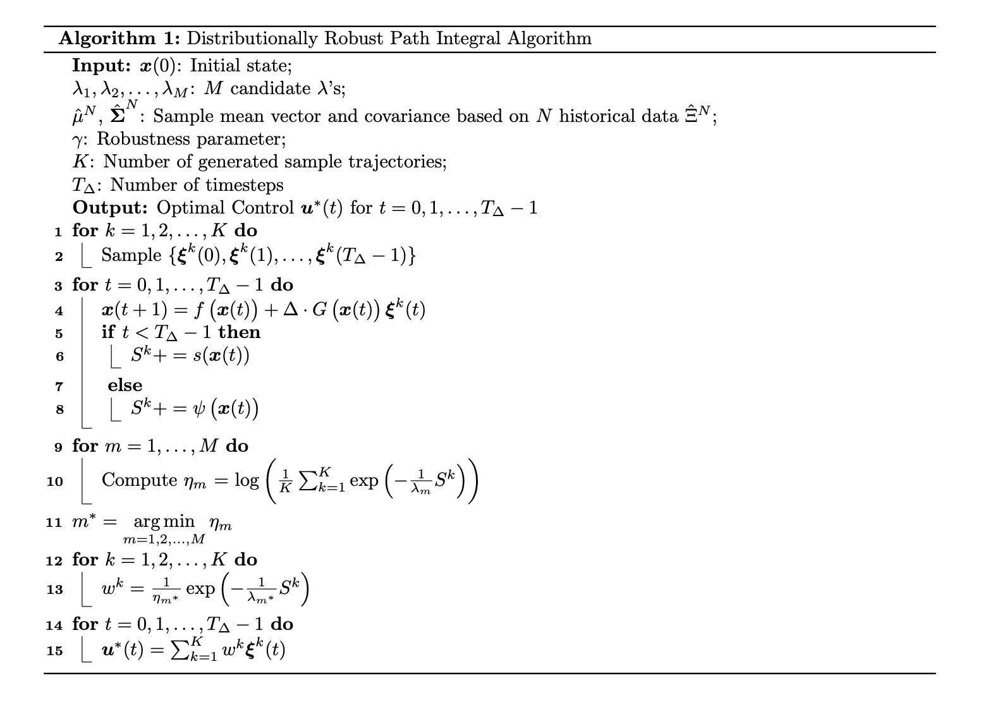

# Distributionally Robust Path Integral Control

## Algorithms

## Tasks

1. implement the grid search: the method: [black box](https://ee227c.github.io/code/lecture20.html) (Finished)
2. Benchmarks
3. New Numerical Exp

## Reference

[2302.11719.pdf (arxiv.org)](https://arxiv.org/pdf/2302.11719.pdf)Control Projects

[Control](https://www.notion.so/Control-3391d5963ff24c069493e7ed2f510b71)

[Control Path](https://www.notion.so/Control-Path-88417fe5c900454c81d95b8198cbf084)
