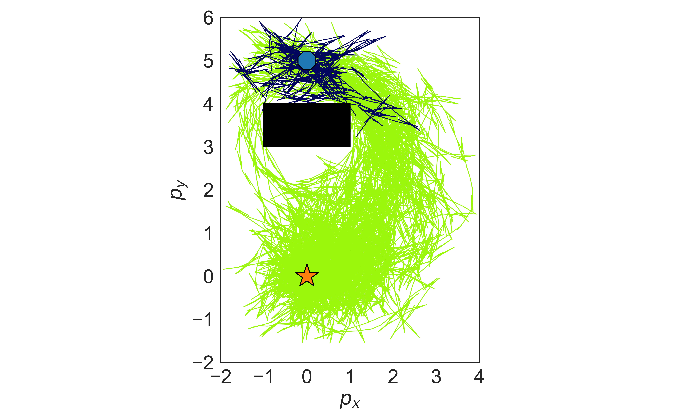

# DR Control

This is the repo of out paper:

## Requirement

```shell
conda create -n DRC python=3.11
conda activate DRC
conda install numpy pandas matplotlib seaborn scipy tqdm
```

## How to Use

### To run the experiments

To run the script, use the following command:

```
python src/main.py [options]
```

#### Options:

- `--DR_method`: Choose a DR method. Options are `"DR NM"`, `"DR GM"`, and `"RN"`. Default is `"DR NM"`.

  - `"DR NM"` represents `"DRPI Numerical Minimization"`,
  - `"DR GM"` represents `"DRPI Robust Global Minimization"`,
  - `"RN"` represents `"Risk-Neutral PIC"`
- `--Experiment`: Set the experiment number. Choose between `"1"` and `"2"`. Default is `"1"`.

  * `"1"` represents `"Input Integrator"`,
  * `"2"` represents `"Unicycle".`
- `--Visualization`: If included, this will visualize the figure.
- `--Online`: If included. this will enable online learning.
- `--seed_value`: Set the seed value. Default is not setting seed.
- `--num_simulation`: Set the number of simulations. Default is `100`.
- `--observations`: Set the number of observations. Default is `1`.
- `--sigma`: Set the value of Sigma. Default is `0.5`.
- `--mu`: Set the mu value. Default is `[0.0, 0.0]`.
- `--max_steps`: Set the maximum number of steps. Default is `1000`.
- `--num_trajs`: Set the number of trajectories. Default is `500`.
- `--num_vis`: Set the number of vis. Default is `500`.
- `--T`: Set the T value. Default is `2.0`.
- `--dt`: Set the dt value. Default is `0.05`.

#### Example

This is the standrad experiment.

```
python src/main.py --DR_method "DR NM" --Experiment "1" --Online --seed_value 1 --num_simulation 1 --observations 1
```

### To visualize the results from logs

To run the script, use the following command:

```
python src/vis.py [options]
```

#### Options:

- `--Experiment`: Choose a model number. Options are `"1"` and `"2"`. Default is `"1"`.

  * `"1"` represents `"Input Integrator"`,
  * `"2"` represents `"Unicycle"`.
- `--Name`: Set the file name. Options include `"log/DRExp1"`, `"log/DRExp2"`, `"log/RNExp1"`, and `"log/RNExp2"`. Default is `"log/DRExp1"`.
- `--SAVE_LOG`: If included, this will save the figure.
- `--Visualization`: If included, this will visualize the figure.

#### Example:

```shell
python src/vis.py --Experiment "1" --Name "log/DRExp1" --Visualization
```

## Results and Visualizations

### Double Integrator Model

<table>
<tr>
<td></td>
<td></td>
</tr>
<tr>
<td></td>
<td></td>
</tr>
</table>

### Performance of different schemes

| Model             | Scheme         | Success Rate (%) | Arrive Time (s) Mean | Std. Dev. | 95 prct. |
| ----------------- | -------------- | ---------------- | -------------------- | --------- | -------- |
| Double Integrator | Non-DR Control | 66               | 21.30                | 12.63     | 44.42    |
| Double Integrator | DR Control     | 96               | 8.04                 | 2.25      | 12.32    |
| Unicycle          | Non-DR Control | 19               | 25.89                | 11.13     | 44.52    |
| Unicycle          | DR Control     | 78               | 16.94                | 6.17      | 28.30    |
